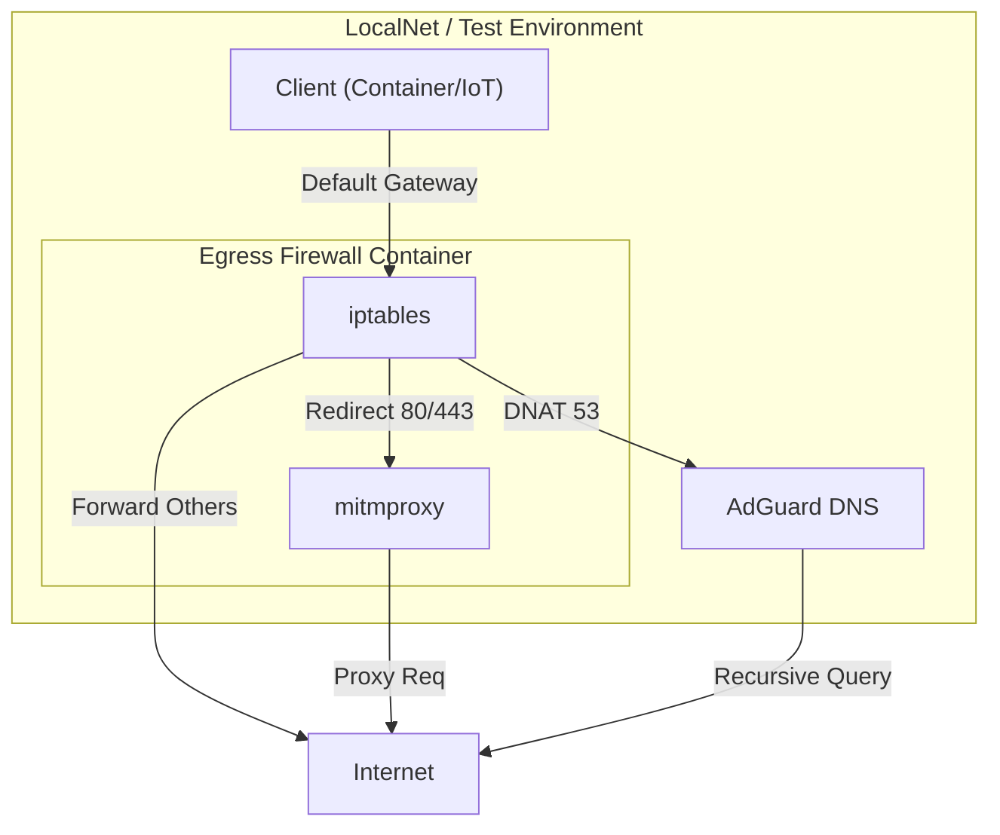

# Unified Egress Security Gateway and MITM Architecture

## Context

The `localnet` environment requires robust egress filtering and traffic inspection capabilities for two distinct use cases:
1.  **Container Isolation**: Locking down specific Docker containers (e.g., test runners, sensitive workloads) to restrict outbound access to allowed domains.
2.  **Network Gateway**: Acting as a router for external devices (IoT, physical machines) or entire subnets, enabling traffic inspection and policy enforcement on "black box" devices.

Previously, these capabilities were fragmented. We had a basic "sidecar" firewall prototype and a separate, diagram-only concept for a "MITM Router" involving `mitmproxy`, `dnsmasq`, and `hostapd`. This fragmentation led to duplicated configuration efforts and inconsistent policy enforcement mechanisms (e.g., how to handle DNS redirection or transparent proxying in both scenarios).

## Decision

We have decided to consolidate all egress security, traffic inspection, and routing functionality into a single, unified service: **`egress-firewall`**.

This service is designed with a "Dual-Mode" architecture controlled by feature flags, allowing it to serve both use cases from a single codebase.

### Key Architectural Components

1.  **Dual-Mode Operation**:
    *   **Sidecar Mode (`GATEWAY_MODE=false`)**: The default mode. Operates using `iptables OUTPUT` rules. Designed for `network_mode: service:firewall`, where the protected application shares the container's network namespace.
    *   **Gateway Mode (`GATEWAY_MODE=true`)**: Operates using `iptables FORWARD`, `PREROUTING`, and `POSTROUTING` (Masquerade). Designed to act as the default gateway for other containers or physical devices on a network.

2.  **Transparent Interception**:
    *   **MITM**: Uses `mitmproxy` (specifically `mitmdump`) in transparent mode. Traffic to ports 80/443 is redirected via `iptables` to the local proxy port.
    *   **DNS**: Supports transparent DNAT of port 53 traffic to a configured upstream (e.g., AdGuard), enforcing DNS policy regardless of the client's configuration.

3.  **Observability Sidecars**:
    *   Heavy traffic analysis tools (Packet Capture, ntopng, Zeek) are decoupled from the core firewall. They are deployed as separate containers attached to the same network bridge or sharing the network namespace, preserving the "Single Responsibility Principle".

## Use Cases

### 1. Isolated Test Runner (Sidecar)
*   **Goal**: Prevent a test script from accidentally hitting production APIs, while allowing access to mocks or specific external resources.
*   **Config**: `GATEWAY_MODE=false`, `ALLOW_DESTINATIONS=github.com`, `ENABLE_MITM=true`.
*   **Mechanism**: The test container is attached to `egress-firewall`. All egress traffic hits the `OUTPUT` chain restrictions. HTTP/S traffic is transparently inspected.

### 2. IoT Device Inspection (Gateway)
*   **Goal**: Analyze traffic from a proprietary IoT device that hardcodes 8.8.8.8 for DNS and communicates over HTTPS.
*   **Config**: `GATEWAY_MODE=true`, `DNS_SERVER=10.0.0.53` (AdGuard).
*   **Mechanism**:
    *   IoT Device sets Gateway IP to `egress-firewall`.
    *   DNS queries to 8.8.8.8 are transparently DNAT'd to AdGuard.
    *   HTTPS traffic is redirected to `mitmproxy` for inspection.
    *   `MASQUERADE` ensures traffic returning from WAN reaches the device correctly.

## Implementation Details

### Configuration Interface (Environment Variables)

| Variable | Mode | Description |
| :--- | :--- | :--- |
| `GATEWAY_MODE` | Global | Toggles between Sidecar (OUTPUT) and Router (FORWARD/NAT) logic. |
| `ALLOW_DESTINATIONS` | Global | Allow-list for egress domains/IPs. Applies to both self and forwarded traffic. |
| `ENABLE_MITM` | Global | Starts `mitmdump` and enables transparent redirection of 80/443. |
| `DNS_SERVER` | Global | Destination IP for transparent DNS routing (DNAT). |
| `WAN_IFACE` | Gateway | Interface to masquerade traffic out of (default `eth0`). |

### Network Flow

## Consequences

### Positive
*   **Single Source of Truth**: One set of scripts handles firewalling and interception for all scenarios.
*   **Consistent Policy**: "Allow Google" means the same thing whether it's a curl request in a container or a phone on the Wi-Fi.
*   **Maintainability**: Reduces the number of distinct service definitions to maintain.
*   **Modularity**: Observability tools can be swapped in/out without rebuilding the gateway.

### Negative
*   **Complexity**: The `entrypoint.sh` logic is more complex as it handles branching for two distinct networking modes.
*   **Privilege**: Requires `NET_ADMIN` capabilities, which is inherent to the function but increases the security surface area of the container itself.
*   **Performance**: User-space proxying (mitmproxy) introduces latency compared to pure kernel-level routing.

## Related Resources
*   Service Definition: `apps/active/devops/localnet/services/security/egress-firewall`
*   Architecture Diagram: `apps/active/devops/localnet/services/security/egress-firewall/ARCHITECTURE.mmd`
