```mermaid
flowchart TD
    START([Start]) --> Q1{What kind of<br/>question?}

    Q1 -->|Filename| FILENAME
    Q1 -->|Exact text| EXACT
    Q1 -->|Fuzzy text| FUZZY
    Q1 -->|AST pattern| AST_PAT
    Q1 -->|AST insights| AST_INS
    Q1 -->|Semantic| SEM

    FILENAME --> F1{Need freshness?}
    EXACT --> E1{Need freshness?}
    FUZZY --> FZ1{Need freshness?}
    AST_PAT --> A1{Need freshness?}
    AST_INS --> AI1{Need freshness?}
    SEM --> S1{Need freshness?}

    F1 -->|Yes| F2{Repo size?}
    F1 -->|No| F3{Repo size?}
    E1 -->|Yes| E2{Repo size?}
    E1 -->|No| E3{Repo size?}
    FZ1 -->|Yes| FZ2{Repo size?}
    FZ1 -->|No| FZ3{Repo size?}
    A1 -->|Yes| A2{Repo size?}
    A1 -->|No| A3{Repo size?}
    AI1 -->|Yes| AI2{Repo size?}
    AI1 -->|No| AI3{Repo size?}
    S1 -->|Yes| S2{Repo size?}
    S1 -->|No| S3{Repo size?}

    F2 -->|Small| R1A["rg --files"]
    F2 -->|Medium| R1A
    F2 -->|Large| R1A
    R1A --> R1B["fd"]

    F3 -->|Small| R2["xgrep (indexed)"]
    F3 -->|Medium| R2
    F3 -->|Large| R3A["Sourcegraph"]
    R3A --> R3B["OpenGrok"]

    E2 -->|Small| R4["ripgrep"]
    E2 -->|Medium| R4
    E2 -->|Large| R4

    E3 -->|Small| R5["xgrep"]
    E3 -->|Medium| R5
    E3 -->|Large| R3A

    FZ2 -->|Small| R6A["fzf"]
    FZ2 -->|Medium| R6A
    FZ2 -->|Large| R6A
    R6A --> R6B["rg + fzf"]

    FZ3 -->|Small| R7["xgrep fuzzy"]
    FZ3 -->|Medium| R7
    FZ3 -->|Large| R8["Sourcegraph fuzzy"]

    A2 -->|Small| A2_LANG{"Tree-sitter grammar?<br/>(50+ langs)"}
    A2 -->|Medium| A2_LANG
    A2_LANG -->|Yes| R9B["Tree-sitter<br/>(precise AST queries)"]
    A2_LANG -->|No| R9A["Comby<br/>(lang-agnostic structural)"]
    A2 -->|Large| R10["Sourcegraph structural<br/>(all indexed langs)"]

    A3 -->|Small| A3_LANG{"In codegraph?<br/>(19 langs: TS/JS, Py, Go,<br/>Rust, Java, C/C++, Ruby,<br/>PHP, Swift, Kotlin, C#,<br/>Scala, Dart, Svelte,<br/>Vue, Liquid, Pascal)"}
    A3 -->|Medium| A3_LANG
    A3_LANG -->|Yes| R11["codegraph<br/>(deep AST + edges)"]
    A3_LANG -->|No| R10
    A3 -->|Large| R10

    AI2 -->|Small| AI2_LANG{"Tree-sitter grammar?<br/>(50+ langs)"}
    AI2 -->|Medium| AI2_LANG
    AI2_LANG -->|Yes| R12B["Tree-sitter<br/>(precise symbol extraction)"]
    AI2_LANG -->|No| R12A["ctags<br/>(remaining major langs)"]
    AI2 -->|Large| R13["Sourcegraph SCIP/LSIF<br/>(all indexed langs)"]

    AI3 -->|Small| AI3_LANG{"In codegraph?<br/>(19 langs, 13 frameworks)"}
    AI3 -->|Medium| AI3_LANG
    AI3_LANG -->|Yes| R14["codegraph<br/>(deep graph + framework routing)"]
    AI3_LANG -->|No| R13
    AI3 -->|Large| R13

    S2 -->|Small| S2_LANG{"In semble_rs?<br/>(10 langs: TS/JS, Py, Go,<br/>Rust, Java, C/C++, Kotlin,<br/>Ruby, PHP, Swift)"}
    S2_LANG -->|Yes| R15["semble_rs<br/>(BM25 + embeddings)"]
    S2_LANG -->|No| R16["qmd<br/>(all langs, query-time)"]
    S2 -->|Medium| S2_LANG
    S2 -->|Large| R16

    S3 -->|Small| R17["Sourcegraph Cody<br/>(all indexed langs)"]
    S3 -->|Medium| R17
    S3 -->|Large| R17

    style R1A fill:#e6f4ea,stroke:#137333
    style R1B fill:#e6f4ea,stroke:#137333
    style R4 fill:#e6f4ea,stroke:#137333
    style R6A fill:#e6f4ea,stroke:#137333
    style R6B fill:#e6f4ea,stroke:#137333
    style R9A fill:#e6f4ea,stroke:#137333
    style R9B fill:#e6f4ea,stroke:#137333
    style R12A fill:#e6f4ea,stroke:#137333
    style R12B fill:#e6f4ea,stroke:#137333
    style R15 fill:#e6f4ea,stroke:#137333
    style R16 fill:#e6f4ea,stroke:#137333
    style R2 fill:#e8f0fe,stroke:#1967d2
    style R5 fill:#e8f0fe,stroke:#1967d2
    style R7 fill:#e8f0fe,stroke:#1967d2
    style R11 fill:#e8f0fe,stroke:#1967d2
    style R14 fill:#e8f0fe,stroke:#1967d2
    style R3A fill:#fce8e8,stroke:#c5221f
    style R3B fill:#fce8e8,stroke:#c5221f
    style R8 fill:#fce8e8,stroke:#c5221f
    style R10 fill:#fce8e8,stroke:#c5221f
    style R13 fill:#fce8e8,stroke:#c5221f
    style R17 fill:#fce8e8,stroke:#c5221f
```

# Decision Record: CodeGraph vs semble_rs — Agent Code Intelligence Tool Selection

- belongs in `internal-docs/adr/adr-20260520001-codegraph-vs-semble-rs-tool-selection.md`

---

You’re thinking about this the right way, Leo — the *actual* taxonomy of search is not “ripgrep vs semantic vs AST,” but the **Cartesian product of (search modality) × (indexing strategy)**.  
And yes: your six categories are the correct primitives.

Below is the **canonical 6×2 matrix**, with **ranked tools**, **repo‑size notes**, and **quantitative comparisons** (including xgrep, Sourcegraph, Comby, OpenGrok, and plocate).

I’m going to be decisive and opinionated — because you prefer deterministic, high‑performance guidance.

---

# 🧩 The 6 Search Modalities

These are the *right* categories:

1. **Filename search**  
2. **AST search** (pattern matching on syntax)  
3. **AST insights** (cross‑refs, call graphs, definitions)  
4. **Text exact match**  
5. **Text fuzzy match**  
6. **Text semantic match**  

Each can be done **with an index** or **without an index**.

This gives us **12 slots** to rank.

---

# 🧭 **Unified Repo Search Decision Tree (Final Version)**  
*(with all categories, repo sizes, and freshness rules)*

---



---

## **STEP 1 — What kind of question are you asking?**

### **A. Filename search**  
→ “Where is `foo.py`?”  
→ “List all `.rs` files.”

### **B. Exact text search**  
→ “Find all occurrences of `parse_user`.”

### **C. Fuzzy text search**  
→ “Find something like `auth` or `authorize`.”

### **D. AST search**  
→ “Find all `if` statements missing an `else`.”

### **E. AST insights**  
→ “Jump to definition.”  
→ “List all functions/classes.”

### **F. Semantic search**  
→ “Where is the code that validates JWTs?”  
→ “Where is the logic that handles user sessions?”

---

## **STEP 2 — Do you need freshness?**

### **Fresh (sees uncommitted changes)**  
→ Local tools: ripgrep, xgrep, codegraph, Comby, Tree‑sitter, ctags, qmd

### **Stale OK (commit‑based)**  
→ Sourcegraph, OpenGrok, plocate

---

## **STEP 3 — Repo size?**

### **Small (<500k LOC)**  
→ Local tools dominate (xgrep, codegraph, Comby)

### **Medium (500k–5M LOC)**  
→ xgrep still great  
→ codegraph still good  
→ Sourcegraph starts to shine

### **Large (5M+ LOC)**  
→ Sourcegraph wins  
→ OpenGrok acceptable  
→ xgrep/codegraph slow down

---

# 🧩 **Final 6×2 Tool Ranking (with repo size + freshness)**

---

## **1️⃣ Filename Search**

### **Without index (fresh)**  
1. **ripgrep** (`rg --files`)  
2. **fd**  
3. **rsdata**  

### **With index (stale)**  
1. **plocate** — fastest system‑wide  
2. **xgrep** — fastest repo‑local  
3. **Sourcegraph** — large repos  

**Rule:**  
- System‑wide → plocate  
- Repo‑local → xgrep  
- Freshness required → ripgrep  

---

## **2️⃣ Exact Text Search**

### **Without index (fresh)**  
1. **ripgrep**  
2. **rsdata**  

### **With index (fresh)**  
1. **xgrep** — repeated queries  
2. **Sourcegraph** — large repos  

**Rule:**  
- One‑off → ripgrep  
- Repeated → xgrep  
- Large repos → Sourcegraph  

---

## **3️⃣ Fuzzy Text Search**

### **Without index**  
1. **fzf**  
2. **ripgrep + fzf**  

### **With index**  
1. **xgrep fuzzy**  
2. **Sourcegraph fuzzy**  

---

## **4️⃣ AST Search (structural patterns)**

### **Without index (fresh)**  
1. **Comby**  
2. **Tree‑sitter**  

### **With index**  
1. **Sourcegraph structural search**  
2. **codegraph**  

**Rule:**  
- Local dev → Comby / Tree‑sitter  
- Large repos → Sourcegraph  

---

## **5️⃣ AST Insights (definitions, references, symbols)**

### **Without index (fresh)**  
1. **Universal‑ctags**  
2. **Tree‑sitter**  
3. **LSP servers**  

### **With index**  
1. **Sourcegraph (SCIP/LSIF)**  
2. **codegraph**  
3. **OpenGrok**  

**Rule:**  
- Local dev → ctags  
- Large repos → Sourcegraph  

---

## **6️⃣ Semantic Search**

### **Without index (fresh)**  
1. **qmd**  
2. **semble_rs**  

### **With index**  
1. **Sourcegraph Cody**  
2. **codegraph + embeddings**  

**Rule:**  
- Small repos → semble_rs  
- Mixed content → qmd  
- Large repos → Sourcegraph  

---

# 🧠 **Sourcegraph vs codegraph — the final rule**

### **codegraph is better when:**
- Repo < 1M LOC  
- You need instant freshness  
- You want local AST insights  
- You want offline search  
- You want zero setup  

### **Sourcegraph is better when:**
- Repo > 5M LOC  
- You need cross‑repo intelligence  
- You want semantic + structural search  
- You want web UI, blame, diffs  
- You want team‑wide search  
- It is only better at scale.

---

# 🏆 Full 6×2 Ranking Table (Best → Worst)

## 1️⃣ Filename Search

### **Without index**
1. **ripgrep** (`rg --files`)  
2. **fd**  
3. **rsdata**  
4. **find**  

### **With index**
1. **plocate** (fast but stale DB; not repo‑aware)
2. **xgrep** (trigram index; fastest repeated queries)  
3. **Sourcegraph** (global index; huge repos)  
4. **OpenGrok** (enterprise indexing)  

**Repo size note:**  
- <1M files → xgrep  
- >1M files → Sourcegraph/OpenGrok  

---

## 2️⃣ AST Search (pattern‑based)

### **Without index**
1. **Comby** (best structural matcher without AST)  
2. **Tree‑sitter CLI** (language‑aware patterns)  
3. **grep/ripgrep** (only if patterns are trivial)
4. **universal‑ctags** (barely qualifies)

### **With index**
1. small-med repos: **codegraph** (local AST graph)  
1. large repos: **Sourcegraph** (indexed structural search)  
3. **OpenGrok** (older but solid)
4. **universal‑ctags** (barely qualifies)

**Repo size note:**  
- Small/medium → codegraph  
- Large/monorepo → Sourcegraph  

---

## 3️⃣ AST Insights (cross‑refs, call graphs, definitions)

### **Without index**
1. **universal‑ctags**  
2. **Comby**
3. **Tree‑sitter queries** (slow but local)  
4. **LSP servers** (ad‑hoc, slow on large repos)
5. **ripgrep** (for trivial patterns)

### **With index**
1. **Sourcegraph** (best cross‑ref engine available)  
2. **codegraph** (local, fast, good for offline)  
3. **OpenGrok** (older, slower)
4. **xgrep** (for trivial patterns)

**Repo size note:**  
- <500k LOC → codegraph  
- >500k LOC → Sourcegraph  

---

## 4️⃣ Text Exact Match

### **Without index**
1. **ripgrep** (fastest non‑indexed search on Earth)  
2. **rsdata** (more filters, slightly slower)  
3. **grep**  

### **With index**
1. **xgrep**  
2. **Sourcegraph**  
3. **OpenGrok**

**Repo size note:**  
- Repeated queries → xgrep  
- Huge repos → Sourcegraph  

---

## 5️⃣ Text Fuzzy Match

### **Without index**
1. **fzf** (interactive fuzzy)  
2. **ripgrep + fzf** (best pipeline)  
3. **skim**  

### **With index**
1. **xgrep fuzzy mode**  
2. **Sourcegraph fuzzy**  
3. **OpenGrok fuzzy**

---

## 6️⃣ Text Semantic Match

### **Without index**
1. **qmd** (query‑time embeddings; great for mixed repos)  
2. **semble_rs** (small repos)  
3. **Ollama embedding scripts**  

### **With index**
1. **Sourcegraph Cody** (semantic + code‑intel)  
2. **codegraph + embeddings**  
3. **OpenGrok + external embeddings**

**Repo size note:**  
- <1M tokens → semble_rs  
- >1M tokens → qmd  
- >10M tokens → Sourcegraph  

---

# 🔥 xgrep vs ripgrep — When is xgrep slower?

### ❌ **Case 1: One‑off single query on a repo you haven’t indexed yet**  
xgrep is **slower** because it must build the index first.

### ⚠️ **Case 2: One‑off single query on an already‑indexed repo**  
xgrep is **slightly slower** than ripgrep for a single literal search.  
(Trigram index overhead.)

### ✅ **Case 3: Any repeated queries**  
xgrep is **2–46× faster** than ripgrep.

### ✅ **Case 4: Any fuzzy or multi‑pattern search**  
xgrep is **always faster**.

### Summary  
- **One query** → ripgrep  
- **Many queries** → xgrep  
- **Huge repos** → Sourcegraph  

---

# 🧭 Updated Decision Tree (with repo‑size clarifications)

## Step 1 — What kind of question?

- **Filename** → ripgrep / xgrep  
- **Exact text** → ripgrep / xgrep  
- **Fuzzy text** → fzf / xgrep  
- **Semantic** → semble_rs / qmd / Sourcegraph  
- **AST pattern** → Comby / codegraph / Sourcegraph  
- **AST insights** → codegraph / Sourcegraph  

## Step 2 — Is this a one‑off or repeated?

- **One‑off** → ripgrep / Comby / qmd  
- **Repeated** → xgrep / codegraph / Sourcegraph  

## Step 3 — Repo size?

- **Small (<500k LOC)** → local tools (ripgrep, Comby, semble_rs, codegraph)  
- **Medium (500k–5M LOC)** → xgrep, qmd, codegraph  
- **Large (5M+ LOC)** → Sourcegraph, OpenGrok  

---

# 🧭 What about `plocate`?

`plocate` is **not repo‑aware**.  
It indexes the entire filesystem via `updatedb`.

**Pros:**  
- Extremely fast  
- Good for system‑wide filename search  

**Cons:**  
- Ignores `.gitignore`  
- Stale DB  
- Not useful for repo‑scoped workflows  

**Verdict:**  
Use `plocate` only for **system‑wide** filename search, not repo search.

**locate alternatives:**  `plocate` is superior to `mlocate` and especially `locate`

---

# 📋 Comprehensive Use Cases

## Agent Workflow Use Cases

### Code Exploration and Understanding
- **Finding symbol definitions**: Use codegraph for precise AST-based symbol resolution across languages
- **Tracing call graphs**: Use codegraph for deep caller/callee traversal; use `semble_rs deps` for quick dependency trees
- **Impact analysis**: Use codegraph for comprehensive impact radius; use `semble_rs impact` for lightweight analysis
- **Framework route mapping**: Use codegraph for framework-aware routing (Django, Flask, FastAPI, Express, NestJS, Rails, Spring)
- **Cross-references**: Use codegraph for import/export relationships, inheritance hierarchies

### Search and Discovery
- **Quick file lookup**: Use `rg --files` or `fd` for filename search without index; use xgrep for repeated queries
- **Exact text search**: Use ripgrep for one-off searches; use xgrep for repeated queries on indexed repos
- **Fuzzy search**: Use fzf interactively; use ripgrep + fzf pipeline for code-aware fuzzy search
- **Semantic search**: Use semble_rs for small repos (<1M tokens); use qmd for mixed repos; use Sourcegraph for large repos (>10M tokens)
- **AST pattern matching**: Use Comby for structural patterns without full AST; use codegraph for indexed AST search

### Build and CI Workflow
- **Log compression**: Use `semble_rs digest` to compress build/test/CI logs by up to 99%
- **Error analysis**: Use compressed logs to identify patterns in build failures
- **Test output summarization**: Use digest to reduce test output noise while preserving errors

## Developer Workflow Use Cases

### Daily Development
- **Code navigation**: Use codegraph via MCP in IDEs for "go to definition" and "find references"
- **Quick grep**: Use ripgrep for immediate text search without setup
- **File finding**: Use `fd` for interactive filename search with regex support
- **Directory tree**: Use `semble_rs tree` for compressed directory listings (9×–747× reduction)

### Code Review
- **Impact assessment**: Use codegraph to understand what a change affects
- **Dependency review**: Use `semble_rs deps` to visualize file dependencies
- **Pattern search**: Use Comby to find code patterns across the codebase

### Refactoring
- **Safe refactoring**: Use codegraph to verify all usages before renaming
- **Dead code detection**: Use codegraph to find unused symbols
- **Architecture exploration**: Use codegraph to understand system structure

## CI/CD Pipeline Use Cases

### Pipeline Optimization
- **Log storage**: Use `semble_rs digest` to reduce CI log storage costs
- **Failure analysis**: Use compressed logs to quickly identify failure patterns
- **Performance monitoring**: Use digest to track build/test performance trends

### Code Quality Gates
- **Semantic search in CI**: Use semble_rs for semantic code search in CI pipelines
- **AST-based checks**: Use codegraph for structural code quality checks
- **Dependency analysis**: Use dependency graphs to detect circular dependencies

---

# 🗂️ Complete Tool Inventory

## Text Search Tools

### ripgrep
- **Purpose**: Fast exact text search without index
- **Use cases**: One-off searches, quick greps, ad-hoc investigations
- **Strengths**: Fastest non-indexed search, respects .gitignore, regex support
- **Weaknesses**: No semantic understanding, no relationship traversal
- **Indexing**: None (streaming search)

### xgrep
- **Purpose**: Fast exact text search with trigram index
- **Use cases**: Repeated queries on same codebase, large repos
- **Strengths**: 2–46× faster than ripgrep for repeated queries
- **Weaknesses**: Requires index build time, slower for single queries
- **Indexing**: Trigram index

### grep
- **Purpose**: Legacy exact text search
- **Use cases**: Systems without ripgrep, compatibility
- **Strengths**: Universal availability
- **Weaknesses**: Slower than ripgrep, no .gitignore awareness
- **Indexing**: None

### rsdata
- **Purpose**: Enhanced text search with filters
- **Use cases**: Searches requiring file type/size filters
- **Strengths**: More filtering options than ripgrep
- **Weaknesses**: Slightly slower than ripgrep
- **Indexing**: None

## Filename Search Tools

### fd
- **Purpose**: Fast filename search
- **Use cases**: Finding files by name/pattern
- **Strengths**: Fast, regex support, .gitignore aware
- **Weaknesses**: No content search
- **Indexing**: None

### find
- **Purpose**: Traditional file finding
- **Use cases**: Complex file system operations
- **Strengths**: Universal, powerful predicates
- **Weaknesses**: Slow, complex syntax
- **Indexing**: None

### plocate
- **Purpose**: System-wide filename search with index
- **Use cases**: System file searches, not repo-specific
- **Strengths**: Extremely fast
- **Weaknesses**: Not repo-aware, ignores .gitignore, stale DB
- **Indexing**: System-wide via updatedb

## Fuzzy Search Tools

### fzf
- **Purpose**: Interactive fuzzy finder
- **Use cases**: Interactive file/command/selection
- **Strengths**: Excellent UX, fast, integrations
- **Weaknesses**: Interactive only
- **Indexing**: None

### skim
- **Purpose**: Fuzzy finder (fzf alternative)
- **Use cases**: When fzf not available
- **Strengths**: Similar to fzf
- **Weaknesses**: Less ecosystem
- **Indexing**: None

## AST and Semantic Tools

### Comby
- **Purpose**: Structural code matching without full AST
- **Use cases**: Find/replace code patterns, refactoring
- **Strengths**: Language-agnostic patterns, no index needed
- **Weaknesses**: Limited compared to full AST
- **Indexing**: None

### Tree-sitter CLI
- **Purpose**: Language-aware pattern matching
- **Use cases**: Precise AST queries
- **Strengths**: Accurate, language-specific
- **Weaknesses**: Requires query knowledge
- **Indexing**: None

### qmd
- **Purpose**: Query-time semantic search with embeddings
- **Use cases**: Semantic search on mixed repos
- **Strengths**: No persistent index, great for varied code
- **Weaknesses**: Slower than indexed semantic search
- **Indexing**: Query-time embeddings

### ctags/universal-ctags
- **Purpose**: Symbol indexing
- **Use cases**: Editor symbol navigation
- **Strengths**: Fast, editor integration
- **Weaknesses**: Limited relationship data
- **Indexing**: Tags file

## Enterprise/Scale Tools

### Sourcegraph
- **Purpose**: Enterprise code intelligence platform
- **Use cases**: Large monorepos, global search, code review
- **Strengths**: Best-in-class cross-refs, semantic search, scalable
- **Weaknesses**: Complex setup, cost, requires infrastructure
- **Indexing**: Full persistent index

### OpenGrok
- **Purpose**: Enterprise code search and cross-reference
- **Use cases**: Large codebases, legacy systems
- **Strengths**: Solid cross-references, web UI
- **Weaknesses**: Older tech, slower than Sourcegraph
- **Indexing**: Full persistent index

---

# 🔄 Index Management Strategy

## Overview

Index creation and refresh is handled through `just bootstrap` to ensure consistency across devbox and direnv environments. This approach provides:

- **Automatic index creation** when entering a project directory
- **Background refresh** to keep indexes current
- **Consistent behavior** across different environment activation methods
- **Zero manual intervention** for developers

## Implementation

### just bootstrap Integration

The `just bootstrap` command includes index management tasks:

```bash
# In justfile
bootstrap:
    #!/usr/bin/env bash
    # ... existing bootstrap tasks ...
    
    # Initialize or refresh search indexes
    just refresh-indexes
```

### Index Refresh Commands

```bash
# Refresh all indexes
just refresh-indexes

# Refresh specific tool indexes
just refresh-codegraph    # CodeGraph AST index
just refresh-xgrep       # xgrep trigram index
just refresh-semble      # semble_rs embeddings (if persistent)
```

### Devbox Integration

Devbox hooks automatically trigger index refresh:

```json
// devbox.json
{
  "hooks": {
    "postActivate": "just refresh-indexes --background"
  }
}
```

### Direnv Integration

Direnv loads indexes on directory change:

```bash
# .envrc
layout devbox

# Refresh indexes in background when entering directory
if just refresh-indexes --background --quiet 2>/dev/null; then
    : # Indexes refreshed successfully
fi
```

### Background Refresh Strategy

Index refresh runs in background to avoid blocking:

- **Non-blocking**: Use `--background` flag
- **Quiet mode**: Use `--quiet` to suppress output
- **Check staleness**: Only refresh if index is older than threshold
- **Incremental updates**: Where supported, update only changed files

### Index Staleness Detection

```bash
# Check if index needs refresh
needs_refresh() {
    local index_file="$1"
    local threshold_minutes=60
    
    if [ ! -f "$index_file" ]; then
        return 0  # No index, needs creation
    fi
    
    local index_age=$(( ($(date +%s) - $(stat -f %m "$index_file")) / 60 ))
    if [ "$index_age" -gt "$threshold_minutes" ]; then
        return 0  # Index stale, needs refresh
    fi
    
    return 1  # Index fresh
}
```

## Tool-Specific Index Behavior

### CodeGraph
- **Index location**: `.codegraph/codegraph.db`
- **Refresh trigger**: File watcher + just bootstrap
- **Incremental**: Yes, via file watcher
- **Background**: Yes

### xgrep
- **Index location**: `.xgrep/index.trigrams`
- **Refresh trigger**: just bootstrap on directory entry
- **Incremental**: No, full rebuild
- **Background**: Yes

### semble_rs
- **Index location**: Ephemeral (in-memory or temp)
- **Refresh trigger**: On each run (by design)
- **Incremental**: N/A (ephemeral)
- **Background**: N/A (fast enough)

### plocate
- **Index location**: System-wide `/var/lib/plocate/plocate.db`
- **Refresh trigger**: System cron/updatedb
- **Incremental**: Yes, via updatedb
- **Background**: Yes (system-managed)

## Performance Considerations

### Index Creation Cost

| Tool | Initial Build | Incremental Update | Refresh Frequency |
|------|--------------|-------------------|-------------------|
| CodeGraph | High (full AST) | Low (file watcher) | On file change |
| xgrep | Medium (trigrams) | High (full rebuild) | On directory entry |
| semble_rs | Low (ephemeral) | N/A | On each run |
| plocate | High (system) | Medium (updatedb) | System cron |

### Recommendations

- **Small repos (<100k LOC)**: Refresh on every directory entry is acceptable
- **Medium repos (100k-1M LOC)**: Refresh with 1-hour staleness threshold
- **Large repos (>1M LOC)**: Refresh with 4-24 hour staleness threshold, use background refresh

---

## Context

Two complementary code intelligence tools are available in the ecosystem:

- **CodeGraph** (`/Users/micro/p/gh/levonk/codegraph`) — A Node.js/TypeScript MCP server that builds a persistent semantic knowledge graph of codebases using tree-sitter AST extraction, SQLite storage, and FTS5 full-text search.
- **semble_rs** (`/Users/micro/p/gh/levonk/semble_rs`) — A Rust CLI tool that performs hybrid BM25 + Model2Vec semantic search over codebases with an ephemeral index, plus build/CI log compression.

Both tools aim to reduce token consumption and tool-call overhead for AI coding agents, but they differ fundamentally in architecture, integration model, and optimal use cases. Without clear guidance, agents and developers may choose the wrong tool for the task, leading to unnecessary setup overhead or missed capabilities.

## Constraints

- Agents must minimize token usage and tool calls per the efficiency targets captured in benchmark literature.
- Some environments cannot run a persistent MCP server or Node.js runtime.
- Some tasks require deep relationship traversal (callers, callees, inheritance) that plain search cannot provide.
- Build and CI output compression is a distinct need from code exploration.

## Decision

**CodeGraph and semble_rs are not interchangeable; they serve complementary roles.**

- Use **CodeGraph** when the agent or developer needs persistent, deep semantic code intelligence integrated via MCP, especially for relationship traversal and framework-aware analysis.
- Use **semble_rs** when the priority is fast, standalone, ephemeral code search or build/CI log compression without infrastructure setup.

## Rationale

CodeGraph invests in upfront indexing and persistent storage to answer complex structural queries instantly. semble_rs trades persistence for zero-config startup and adds a unique `digest` capability for build output. Keeping both in the toolbox lets the right capability be matched to the right context rather than forcing one tool to serve all purposes.

## Technical Approach

### When to Use CodeGraph

| Condition | Rationale |
|---|---|
| The agent runs inside **Claude Code, Cursor, Codex CLI, or opencode** with MCP support | CodeGraph exposes an MCP server (`codegraph serve --mcp`) with purpose-built tools (`codegraph_search`, `codegraph_context`, `codegraph_callers`, `codegraph_callees`, `codegraph_impact`) |
| **Persistent code knowledge graph** is acceptable/desired | One-time `codegraph init -i` creates `.codegraph/codegraph.db`; file watcher keeps it fresh |
| Task requires **relationship traversal** — callers, callees, impact radius, inheritance | CodeGraph resolves and stores edges (calls, imports, extends, implements) at index time |
| **Framework-aware routing** matters (Django, Flask, FastAPI, Express, NestJS, Rails, Spring, etc.) | CodeGraph detects 13+ frameworks and links URL patterns to handlers |
| Working with **19+ supported languages** needing full AST extraction | TypeScript, Python, Go, Rust, Java, C#, PHP, Ruby, C, C++, Swift, Kotlin, Scala, Dart, Svelte, Vue, Liquid, Pascal/Delphi |
| Environment supports **Node.js 20–24** and native SQLite (or WASM fallback) | CodeGraph is an npm package; native backend is 5–10x faster than WASM fallback |

**Benchmark impact**: ~35% cheaper, ~59% fewer tokens, ~49% faster, ~70% fewer tool calls on large codebases when agents use CodeGraph via MCP.

### When to Use semble_rs

| Condition | Rationale |
|---|---|
| **No MCP server** available or agent does not support MCP | semble_rs is a standalone CLI; no daemon, no API keys, no GPU |
| **Ephemeral search** is preferred — no persistent index files | Index is rebuilt every run; zero config, zero leftover artifacts |
| Need **build / test / CI log compression** (`digest`) | `cargo build 2>&1 \| semble_rs digest` reduces output by up to -99%; auto-detects cargo, pnpm, pytest, tsc, go test, gradle, ruff, mypy, clang, GitHub Actions |
| Need a **token-efficient codebase tree** instead of `ls -R` | `semble_rs tree` collapses directory listings by 9×–747× |
| Need **semantic + lexical hybrid search** with code-aware reranking | BM25 + Model2Vec embeddings fused with RRF, reranked by definition boost, identifier stem matching, file coherence, sibling-chunk boost, dependency boost, and noise penalties |
| Need **dependency / impact analysis** as ASCII tree or Graphviz DOT | `semble_rs deps <file>` and `semble_rs impact <file>` with `--tree` and `--dot` output |
| Environment prefers a **single static binary** (Rust, no Node.js) | `cargo install --path .` produces one binary; also available via Nix flakes |
| Working with **Rust, Python, JS/TS, Go, Java, C/C++, Kotlin, Ruby, PHP, Swift** | Full search + AST chunking + dependency graph for these; line-based fallback for others |

### Quick Decision Matrix

| Need | CodeGraph | semble_rs |
|---|---|---|
| MCP-integrated agent assistance | ✅ Primary | ❌ |
| Standalone CLI search | ⚠️ Possible | ✅ Primary |
| Persistent knowledge graph | ✅ Yes | ❌ Ephemeral |
| Build/CI log compression | ❌ | ✅ `digest` |
| Call graph traversal | ✅ Deep | ✅ Flat + tree |
| Framework route detection | ✅ 13+ frameworks | ❌ |
| Zero-config startup | ⚠️ Needs `init` | ✅ No setup |
| Node.js runtime required | ✅ Yes | ❌ No |
| Single binary, no daemon | ❌ | ✅ Yes |

### Language-Specific Guidance

| Language | CodeGraph | semble_rs | Recommendation |
|---|---|---|---|
| **TypeScript / JavaScript** | ✅ Full AST + edges | ✅ Full search + AST + deps | Either; prefer CodeGraph for MCP-driven relationship queries, semble_rs for ephemeral search or `digest` |
| **Python** | ✅ Full AST + edges | ✅ Full search + AST + deps | Either; same as above |
| **Go** | ✅ Full AST + edges | ✅ Full search + AST + deps | Either; same as above |
| **Rust** | ✅ Full AST + edges | ✅ Full search + AST + deps | Either; same as above |
| **Java** | ✅ Full AST + edges | ✅ Full search + AST + deps | Either; same as above |
| **C / C++** | ✅ Full AST + edges | ✅ Full search + AST + deps | Either; same as above |
| **Swift** | ✅ Full AST + edges | ✅ Full search + AST + deps | Either; same as above |
| **Kotlin** | ✅ Full AST + edges | ✅ Full search + AST + deps | Either; same as above |
| **Ruby** | ✅ Full AST + edges | ✅ Full search + AST + deps | Either; same as above |
| **PHP** | ✅ Full AST + edges | ✅ Full search + AST + deps | Either; same as above |
| **C#** | ✅ Full AST + edges | ⚠️ Search only (line-based fallback) | **CodeGraph** for deep analysis |
| **Scala** | ✅ Full AST + edges | ⚠️ Search only (line-based fallback) | **CodeGraph** for deep analysis |
| **Dart** | ✅ Full AST + edges | ⚠️ Search only (line-based fallback) | **CodeGraph** for deep analysis |
| **Svelte** | ✅ Full AST + edges (Svelte 5 runes, SvelteKit routes) | ⚠️ Search + line-based chunking + partial deps | **CodeGraph** for framework-aware routing and full AST |
| **Vue** | ✅ Full AST + edges (script + script-setup, Nuxt routes) | ⚠️ Search + line-based chunking + partial deps | **CodeGraph** for framework-aware routing and full AST |
| **Liquid** | ✅ Full AST + edges | ❌ Not supported | **CodeGraph only** |
| **Pascal / Delphi** | ✅ Full AST + edges (classes, records, interfaces, enums, DFM/FMX) | ❌ Not supported | **CodeGraph only** |
| **HTML / CSS** | ⚠️ Not listed | ⚠️ Search + line-based chunking | **semble_rs** if needed; limited value for both |
| **Other / Misc** | ❌ Not supported | ⚠️ Search + line-based chunking | **semble_rs** as fallback |

**Rule of thumb for languages both tools support**: Default to CodeGraph when MCP is available and you need persistent graph, relationship queries, or framework routing. Default to semble_rs when you need zero-setup ephemeral search, build-log `digest`, or a Node.js-free environment.

## Consequences

### Positive

- **Clear tool selection** reduces setup friction and avoids capability gaps.
- **Both tools can coexist** in the same workflow: semble_rs for quick lookup and digest, CodeGraph for deep MCP-driven exploration.
- **Token efficiency** is maximized by routing each task to the tool optimized for it.

### Negative

- **Two tools to maintain** means two sets of versions, configs, and environment requirements.
- **CodeGraph requires Node.js**; teams standardized on Rust-only tooling may prefer semble_rs despite narrower relationship analysis.

### Neutral

- Neither tool replaces the other; they overlap only in surface-level search. Long-term, either tool could expand into the other's domain, but that is not assumed or required.

## Alternatives Considered

- **Standardize on CodeGraph only**
  - *Pros*: One tool, richer relationship data, MCP ecosystem alignment.
  - *Cons*: Node.js dependency; no build-log compression; requires persistent index in environments where ephemeral is preferred.

- **Standardize on semble_rs only**
  - *Pros*: Single Rust binary, zero config, digest capability.
  - *Cons*: No MCP integration; no framework-aware routing; no persistent graph for incremental sync.

- **Build a unified wrapper**
  - *Pros*: Single interface.
  - *Cons*: Hides meaningful capability differences; adds maintenance burden without clear benefit.

## Rollout / Migration

1. Document this ADR in agent instruction files (e.g., `CLAUDE.md`, `AGENTS.md`, `.cursorrules`).
2. When onboarding a new codebase, evaluate whether MCP is available:
   - If yes → initialize CodeGraph (`codegraph init -i`).
   - If no or ephemeral preferred → use semble_rs commands directly.
3. For CI pipelines, prefer semble_rs `digest` for log compression.
4. Periodically re-evaluate as both tools evolve.

## Validation

This decision is validated when:

- Agents consistently choose CodeGraph for MCP-driven deep exploration and semble_rs for standalone search/digest.
- Measured token/tool-call savings meet or exceed published benchmarks for each tool's sweet spot.
- No team reports being blocked because the wrong tool was mandated for their environment.

## References

- CodeGraph repository: `/Users/micro/p/gh/levonk/codegraph` — README with MCP tools, benchmarks, and framework support matrix.
- semble_rs repository: `/Users/micro/p/gh/levonk/semble_rs` — README with search modes, digest benchmarks, and language support matrix.
- ADR process background: `/Users/micro/p/gh/levonk/dotfiles/home/current/.chezmoitemplates/config/ai/workflows/software-dev/architecture/adr.md`
- https://github.com/momokun7/xgrep https://pypi.org/project/xgrep/ 
- https://github.com/tobi/qmd
- https://github.com/junegunn/fzf
- https://github.com/colbymchenry/codegraph
- https://github.com/sourcegraph/sourcegraph-public-snapshot
- https://github.com/johunsang/semble_rs https://github.com/MinishLab/semble
- https://github.com/tree-sitter/tree-sitter
- https://github.com/sourcegraph/sourcegraph-public-snapshot
- 

<!-- vim: set ft=markdown: -->
