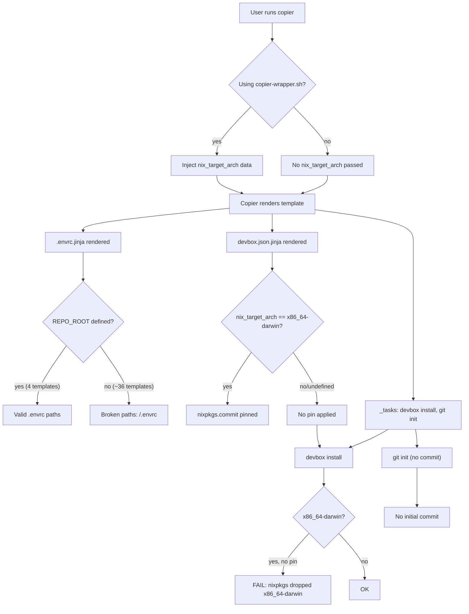
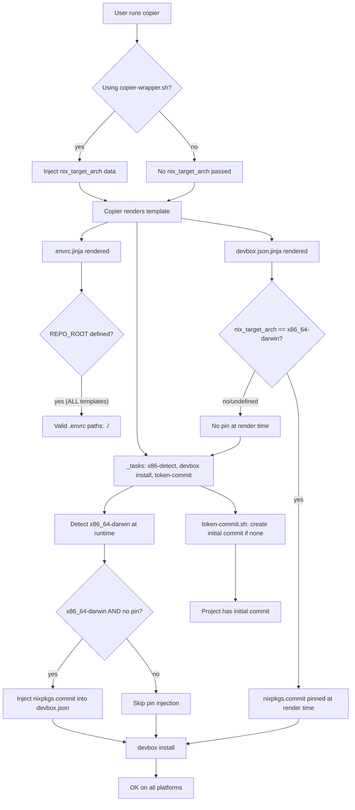

---
# Product Requirements Document (PRD)

## Tech Context (Binding Constraint)

This project uses the following tools. Use them, not alternatives.

- Package manager: none (template catalog, not a software project)
- Ad-hoc runner: devbox run -- <command> for system tools
- Build system: copier (template rendering)
- Template engine: Jinja2 (.jinja files)
- Scripts: Bash
- Environment: devbox + direnv + nix
- Validation: post-copy _tasks grep for unrendered Jinja artifacts

System tools run via: devbox run -- <command>
Never use: npm, npx, yarn, pip install (this is not a Node/Python project)

## Introduction / Overview
- **Feature name:** Boilerplate Copier Fixes — REPO_ROOT, x86_64-darwin Devbox Pin, Token Commit
- **Summary:** Three bug fixes to the boilerplate copier template catalog: (1) add the missing `REPO_ROOT` variable definition to all copier.yml files whose .envrc.jinja templates reference it, (2) make post-copy tasks intelligently detect x86_64-darwin and inject the nixpkgs commit pin at runtime so `devbox install` succeeds on Intel Macs even when copier is run without the wrapper, and (3) create a shared post-copy script that creates an initial token git commit if the generated project has no commits.
- **Context:**
  - The boilerplate catalog contains 52 Copier templates. Many templates include a shared `.envrc.jinja` partial that references `{{REPO_ROOT}}`, but only 4 of those templates define `REPO_ROOT` in their `copier.yml`. When copier renders a template without the definition, `{{REPO_ROOT}}` evaluates to an empty string, producing broken paths like `/.envrc` instead of `./.envrc`.
  - nixpkgs dropped x86_64-darwin (Intel Mac) support in the 26.11 release cycle. The `copier-wrapper.sh` already detects the Nix target architecture and passes it as `--data nix_target_arch=<triple>`, and most `devbox.json.jinja` templates conditionally pin nixpkgs when `nix_target_arch == "x86_64-darwin"`. However, the `repo/git-repo` template's post-copy task runs `devbox install` directly — if copier is invoked without the wrapper (or the data variable is not passed), the pin is skipped and `devbox install` fails on Intel Macs.
  - After copier generates a project, the `repo/git-repo` template runs `git init` but does not create an initial commit. A token commit ensures the generated project has a clean git baseline that users can branch from immediately.

## Goals
- Every template that references `{{REPO_ROOT}}` in its .envrc.jinja must define `REPO_ROOT` in its copier.yml with default `.`
- Post-copy tasks that run `devbox install` must detect x86_64-darwin at runtime and inject the nixpkgs commit pin into devbox.json if the pin is missing
- A shared bash script creates an initial token git commit after copier runs, if no commits exist yet
- All three fixes must be verifiable by rendering a template and checking the output

## User Stories

### As a developer scaffolding a project from a boilerplate template
- I want `{{REPO_ROOT}}` to always render correctly so that my `.envrc` file has valid paths
- I want `devbox install` to succeed on my Intel Mac without manually passing architecture data
- I want my generated project to have an initial git commit so I can immediately start working

### As a boilerplate maintainer
- I want REPO_ROOT to be defined once in a shared location so I don't have to add it to every template manually
- I want the x86_64-darwin detection to be a shared script so all post-copy tasks can use it
- I want the token commit script to be shared so all templates can wire it into their post-copy tasks

## Functional Requirements

### Fix 1: REPO_ROOT Definition (FR-1)
1. **Add REPO_ROOT to copier.yml files**
   - Every copier.yml whose template tree includes a .envrc.jinja that references `{{REPO_ROOT}}` must define `REPO_ROOT` as a string variable with default `.`
   - The definition should match the existing pattern in `apps/web/typescript/nextjs/copier.yml` and `repo/pnpm-monorepo/copier.yml`
   - The variable should be placed after `project_name` (or equivalent) and before `description`
   - Templates that already define REPO_ROOT (nextjs, pnpm-monorepo, fastapi, browser-extension) should not be modified

2. **Verification**
   - After the fix, rendering any affected template with `--defaults` must produce a `.envrc` with `.` in place of `{{REPO_ROOT}}`, not an empty string
   - The post-copy Jinja artifact grep validation must pass (no unrendered `{{REPO_ROOT}}` in output)

### Fix 2: x86_64-darwin Devbox Pin in Post-Copy Tasks (FR-2)
3. **Runtime architecture detection in post-copy tasks**
   - The `repo/git-repo` template's post-copy task runs `devbox install`. Before running `devbox install`, the task must detect whether the current platform is x86_64-darwin (Intel Mac)
   - If x86_64-darwin is detected AND the generated `devbox.json` does not already contain a `nixpkgs.commit` pin, the task must inject the pin `293d6abedf0478e681a4dfcfcb35b30fc796a32f` into `devbox.json`
   - This is a runtime fallback that works even when copier is invoked without the wrapper (and thus `nix_target_arch` is not passed as data)
   - The detection logic should be a shared bash function/script so other post-copy tasks can reuse it

4. **Non-destructive injection**
   - If `devbox.json` already has a `nixpkgs.commit` field (because the template rendered it via the `nix_target_arch` data variable), the task must NOT overwrite it
   - If the platform is not x86_64-darwin, the task must NOT modify `devbox.json`

5. **Verification**
   - On x86_64-darwin: after rendering `repo/git-repo` without the wrapper, `devbox.json` must contain the nixpkgs commit pin
   - On aarch64-darwin or linux: `devbox.json` must not be modified by the post-copy task

### Fix 3: Token Commit Script (FR-3)
6. **Shared token-commit script**
   - Create a shared bash script at `_shared/scripts/token-commit.sh` that:
     - Initializes git if `.git` does not exist (`git init`)
     - Checks if there are any commits (`git rev-parse --verify HEAD`)
     - If no commits exist, stages all files and creates an initial commit with message `Initial commit (scaffolded from boilerplate)`
     - If commits already exist, does nothing (non-destructive)
     - Exits 0 on success or if commits already exist
   - The script must be self-contained (no dependencies beyond git and bash)

7. **Wire into post-copy tasks**
   - The `repo/git-repo` template's post-copy task should call the token-commit script after `git init`
   - Other templates with post-copy tasks that do `git init` should also call it
   - The script should be copied into the generated project (or invoked inline) so it works in the destination directory

8. **Verification**
   - After rendering `repo/git-repo`, the generated project must have at least one git commit
   - Re-running the script on a project that already has commits must be a no-op

## Non-Functional Requirements
- All changes must be in bash and Jinja2 — no new dependencies
- The shared scripts must be POSIX-compatible where possible (bash is acceptable since all target platforms have it)
- Changes must not break existing templates that already work (nextjs, pnpm-monorepo, fastapi, browser-extension)
- The token-commit script must not clobber user customizations if the user has already made commits

## Current State

### Relevant files and their roles
- `copier-wrapper.sh` — universal wrapper that copies shared partials and injects `nix_target_arch` data variable
- `_shared/dot_envrc.jinja` — shared direnv partial that references `{{REPO_ROOT}}` (lines 13-14, 18-19, 24)
- `_shared/dot_envrc.template.jinja` — shared .envrc template wrapper that includes the partial and references `{{REPO_ROOT}}` (lines 8-9)
- `apps/web/typescript/nextjs/copier.yml` — already defines REPO_ROOT (lines 29-32) — reference pattern
- `repo/pnpm-monorepo/copier.yml` — already defines REPO_ROOT (lines 34-39) — reference pattern
- `repo/git-repo/copier.yml` — post-copy task runs `devbox install` and `git init` but no token commit
- `repo/git-repo/files/devbox.json.jinja` — has conditional nixpkgs pin via `nix_target_arch` (lines 2-5)
- `packages/category/general/domain/package-name/go/devbox.json.jinja` — reference for nixpkgs pin pattern (lines 2-5)

### Templates with .envrc.jinja using {{REPO_ROOT}} but missing copier.yml definition (~36 files)
- All `apps/cli/*/core/files/.envrc.jinja` (bash, csharp, go, java, powershell, python, ruby, rust, swift, typescript)
- All `packages/category/general/domain/package-name/*/files/.envrc.jinja` (bash, clang, csharp, go, java, powershell, python, ruby, rust, swift, typescript)
- `packages/category/web/domain/package-name/*/files/.envrc.jinja` (python3, typescript)
- `apps/infrastructure/ai-ollama-samples/.envrc.jinja`
- `apps/infrastructure/airflow-project/.envrc.jinja`
- `apps/infrastructure/docker/*/files/.envrc.jinja` (docker-compose, docker-linux, docker-nix, test-template)
- `apps/plugins/mcp/mcp-server/files/.envrc.jinja`
- `apps/plugins/vscode/typescript/files/.envrc.jinja`
- `repo/git-repo/files/.envrc.jinja`

### Repository conventions
- Shared partials live in `_shared/` and are copied into each template's `partials.bak/` by `copier-wrapper.sh`
- Templates include shared partials via ``
- copier.yml variables are defined with `type: str`, `help:`, and `default:`
- Post-copy tasks are defined in `_tasks:` section of copier.yml
- The `_shared/` directory mirrors the template tree structure

### Design constraints
- The nixpkgs commit pin for x86_64-darwin is `293d6abedf0478e681a4dfcfcb35b30fc796a32f` (already used in existing templates)
- The `copier-wrapper.sh` already passes `nix_target_arch` as a copier data variable — the runtime detection is a fallback for when the wrapper is not used

## Architecture Diagram

### Current Architecture

### Target Architecture

## Verification Approach

| Purpose | Command | Expected Result |
|---------|---------|-----------------|
| REPO_ROOT fix | `grep -r "REPO_ROOT" <template>/copier.yml` | REPO_ROOT defined with default `.` |
| REPO_ROOT render | Render a template with `--defaults`, check `.envrc` for `./` paths | No `/.envrc` broken paths |
| x86 detection | Run post-copy task on x86_64-darwin without wrapper | devbox.json has nixpkgs.commit |
| x86 non-destructive | Run post-copy task when pin already exists | devbox.json unchanged |
| Token commit | Render repo/git-repo, check `git log` | At least 1 commit exists |
| Token commit idempotent | Run token-commit.sh on project with existing commits | No-op, exit 0 |
| Jinja artifact check | Post-copy grep validation | No unrendered `{{...}}` or `` |

## Success Criteria (Machine-Checkable)
- [x] All copier.yml files whose templates use `{{REPO_ROOT}}` define `REPO_ROOT` with default `.` (32 files modified)
- [x] The `repo/git-repo` post-copy task detects x86_64-darwin and injects nixpkgs pin if missing (sed-based injection)
- [x] The token-commit script exists at `_shared/scripts/token-commit.sh` and creates an initial commit if none exist
- [x] The `repo/git-repo` post-copy task calls the token-commit logic (inlined in post-copy task)
- [x] No existing template that already defines REPO_ROOT is modified (nextjs, pnpm-monorepo, fastapi, browser-extension untouched)
- [x] The shared x86 detection script exists at `_shared/scripts/ensure-devbox-x86-pin.sh`
- [x] YAML validation passes for the modified `repo/git-repo/copier.yml`
- [x] Jinja `` / `` blocks are balanced (2 each) and `{{ create_gh_pages }}` is outside raw blocks

## Implementation Status

**Completed:** 2026-08-14

All 4 stories completed successfully:
- **Story 01-001**: Added REPO_ROOT to 32 copier.yml/copier.yaml files
- **Story 01-002**: Created `_shared/scripts/ensure-devbox-x86-pin.sh` (shared x86_64-darwin detection + pin injection)
- **Story 01-003**: Created `_shared/scripts/token-commit.sh` (shared initial commit script)
- **Story 02-001**: Wired x86 detection + token commit logic into `repo/git-repo/copier.yml` post-copy task

**Deviations from plan:**
- The `repo/git-repo` post-copy task inlines the x86 detection and token-commit logic directly (using `` blocks) rather than calling the shared scripts as external files. This is because the generated project doesn't need to keep the scripts — the logic only runs once at copy time. The shared scripts at `_shared/scripts/` remain available for other templates and for testing.
- The x86 detection in the post-copy task uses `sed` for JSON injection (instead of python3/jq) to avoid YAML block scalar indentation issues with heredocs. The shared script (`ensure-devbox-x86-pin.sh`) retains the full python3/jq/sed fallback chain.

## Out of Scope
- Fixing the broken include in `apps/infrastructure/docker/simple-service/files/devbox.json.jinja` (references non-existent shared partial) — separate issue
- Adding the x86_64-darwin pin to the 10 devbox.json.jinja files that include shared partials (they already get the pin via the include)
- Migrating all post-copy tasks to use the shared x86 detection script (only repo/git-repo is in scope; other templates can adopt it later)
- Updating the nixpkgs commit hash (the existing hash `293d6abedf0478e681a4dfcfcb35b30fc796a32f` is used as-is)

## Risk Assessment
- **Priority:** P2
- **Effort:** M
- **Risk:** LOW — changes are additive (new copier.yml variables, new script, runtime fallback). No existing functionality is removed.

## Success Metrics
- All ~36 affected templates render with valid `.envrc` paths
- `devbox install` succeeds on x86_64-darwin after rendering `repo/git-repo` without the wrapper
- Generated projects have an initial git commit

## Open Questions
- None — the 3 changes are well-defined with clear reference patterns

## Dependencies
- None — all changes are self-contained within the boilerplate catalog

## Timeline / Milestones
- Story 01: Fix REPO_ROOT (all copier.yml files) — parallel-safe, no dependencies
- Story 02: Create shared x86_64-darwin detection script — parallel-safe, no dependencies
- Story 03: Create shared token-commit script — parallel-safe, no dependencies
- Story 04: Wire x86 detection + token commit into repo/git-repo post-copy task — depends on 02 and 03

## Maintenance Notes
- When adding a new template that uses .envrc.jinja, always add `REPO_ROOT` to its copier.yml
- When adding a new post-copy task that runs `devbox install`, use the shared x86 detection script
- When adding a new post-copy task that does `git init`, use the shared token-commit script
- The nixpkgs commit pin may need updating periodically as nixpkgs maintains x86_64-darwin support on older commits

## STOP Conditions
Stop and report back (do not improvise) if:
- The existing REPO_ROOT definitions in nextjs/pnpm-monorepo/fastapi/browser-extension use a different pattern than expected
- The nixpkgs commit hash is invalid or unavailable
- A template's copier.yml has a structure that makes adding REPO_ROOT non-trivial
- The post-copy task in repo/git-repo has dependencies that prevent modification

---
*Generated from PRD template*
